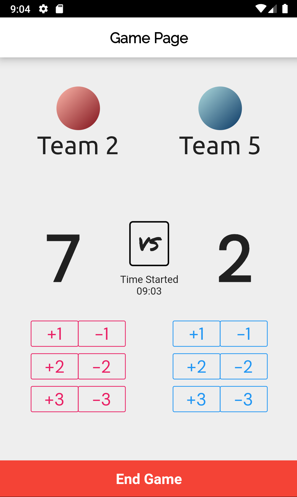

# tourney

Tourney is an mobile application that is useful when organising sporting events or other competitions in your school or community!

## Getting Started

1. Clone the project
2. Install Flutter on your machine
3. Using an emulator or a connected device, run this project in profile mode
```bash
 flutter run --profile
 ```

## Features

### Ease of Use
There is no need to signup/login to use this application as the application uses tournament and organiser codes that allows for tournaments to be shared with other organisers and participants with ease!

| Tourney Code | Organiser Pin |
|-----|-----|
|  |  |

### Completely Realtime
Organisers will be able to update an ongoing tournament's status in realtime through our organiser platform. Organiser can create games and record the progress of games and also manage completed games if needed.
| Game Page | Game Manager |
|-----|-----|
|  |  |


At the same time, participants of the the tournament will also receive realtime updates on the tournament status, which includes past game statistics and also a leaderboard for participating teams!
| Ranking Page | Games List |
|-----|-----|
|  |  |

## Built With

[Flutter](https://flutter.dev/) - Main UI Framework
with various dart packages created by the Dart Community <3